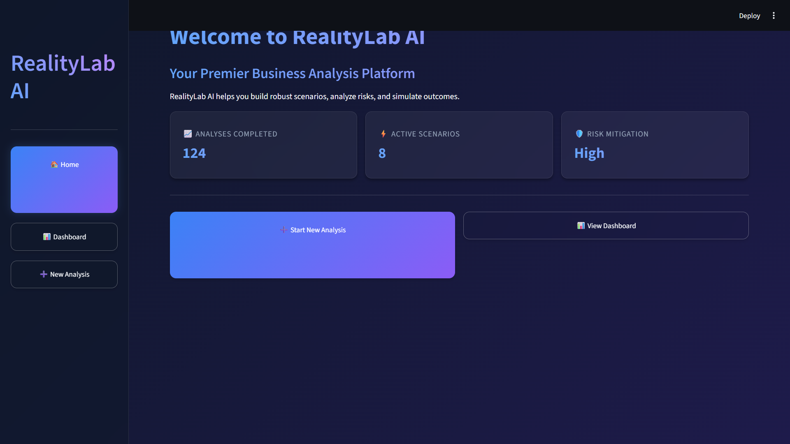
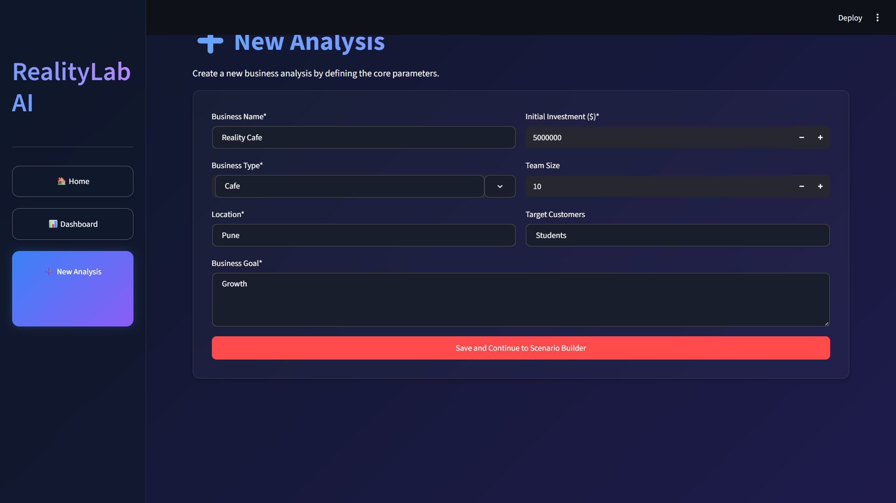
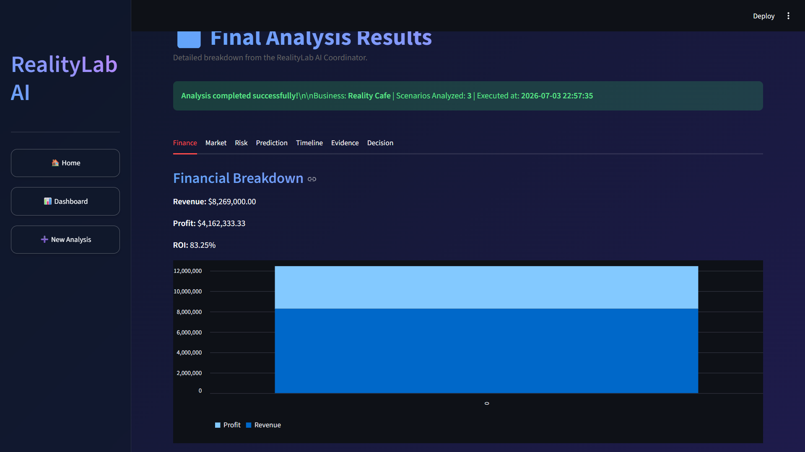
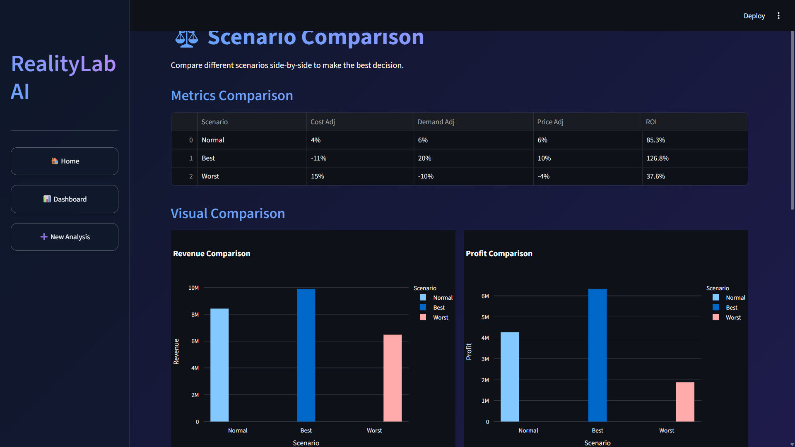
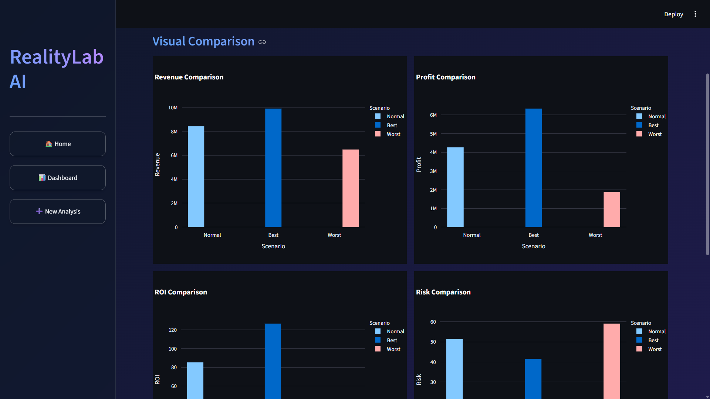
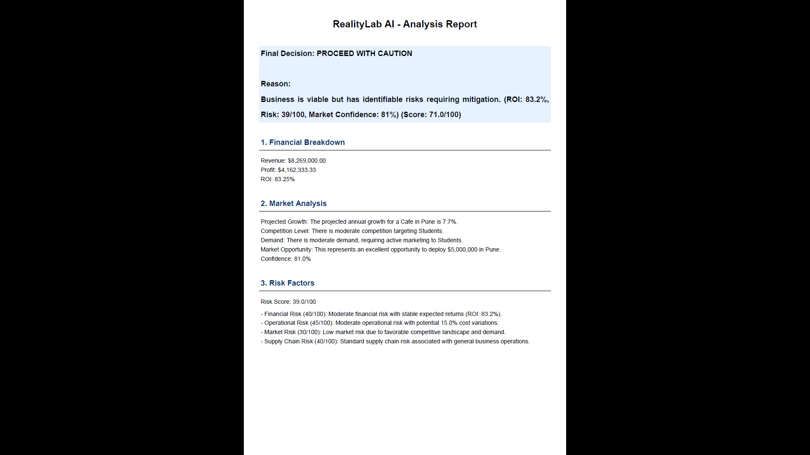

# 🚀 RealityLab AI

> **An AI-Powered Business Decision Intelligence Platform**

RealityLab AI is a production-ready multi-agent business analysis platform that helps entrepreneurs and organizations evaluate business ideas using financial forecasting, market analysis, risk assessment, scenario simulation, and AI-generated reports.

---

## ✨ Features

- 📊 Financial Forecasting
- 💰 Revenue, Profit & ROI Estimation
- ⚠️ Business Risk Assessment
- 📈 Market Opportunity Analysis
- 🧠 AI Decision Intelligence
- 🔄 Multi-Scenario Simulation (Best, Normal, Worst)
- 📉 Interactive Charts & Visualizations
- 📑 Professional PDF Report Generation
- 🗄️ SQLite Database Integration
- ⚡ FastAPI Backend
- 🎨 Streamlit Frontend

---

# 🏗️ Architecture

```
               Streamlit Frontend
                       │
                       ▼
                FastAPI Backend
                       │
        ┌──────────────┼──────────────┐
        ▼              ▼              ▼
 Financial Engine  Market Engine  Risk Engine
        ▼              ▼              ▼
             AI Decision Coordinator
                       │
                       ▼
              Report Generation Engine
                       │
                       ▼
                 SQLite Database
```

---

# 🛠️ Tech Stack

## Frontend

- Streamlit
- Plotly
- Pandas

## Backend

- FastAPI
- Python
- SQLite

## AI Components

- Financial Analysis Engine
- Market Intelligence Engine
- Risk Assessment Engine
- Prediction Engine
- Timeline Engine
- Evidence Engine
- Decision Engine
- Report Engine

---

# 📁 Project Structure

```
RealityLab-AI/
│
├── backend/
├── frontend/
├── shared/
├── tests/
├── reports/
├── docs/
├── deployment/
├── docker/
├── scripts/
├── sdk/
│
├── app.py
├── requirements.txt
├── Dockerfile
├── docker-compose.yml
├── README.md
└── realitylab.db
```

---

# 🚀 Installation

Clone the repository

```bash
git clone https://github.com/awcharvaibhav0-create/RealityLab-AI.git
cd RealityLab-AI
```

Install dependencies

```bash
pip install -r requirements.txt
```

---

# 🔑 Environment Variables

Create a `.env` file in the project root.

```env
GEMINI_API_KEY=YOUR_API_KEY
DATABASE_PATH=realitylab.db
LOG_LEVEL=INFO
```

---

# ▶️ Running the Backend

```bash
python -m uvicorn backend.api.api_manager:app --reload
```

Backend URL

```
http://127.0.0.1:8000
```

API Documentation

```
http://127.0.0.1:8000/docs
```

---

# ▶️ Running the Frontend

```bash
streamlit run frontend/app.py
```

Frontend URL

```
http://localhost:8501
```

---

## 📸 Screenshots

### Dashboard


### New Analysis


### Results


### Scenario Builder


### Scenario Comparison


### PDF Report



# 🧪 Testing

Run all tests

```bash
pytest
```

Compile the project

```bash
python -m compileall .
```

---

# 🎯 Current Capabilities

- Business Feasibility Analysis
- Revenue Forecasting
- Profit Estimation
- ROI Calculation
- Risk Scoring
- Decision Score Calculation
- Market Opportunity Analysis
- Scenario Comparison
- Interactive Dashboard
- PDF Report Generation
- Historical Analysis Storage

---

# 🔮 Future Improvements

- User Authentication
- Cloud Database Integration
- AI Chat Assistant
- Multi-language Support
- Team Collaboration
- Advanced Forecast Models
- Cloud Deployment

---

# 📜 License

This project is licensed under the MIT License.

---

# 👨‍💻 Author

**Vaibhav Awchar**

B.Tech Computer Science (AI & ML)

MIT Academy of Engineering

GitHub: https://github.com/awcharvaibhav0-create

---

# 🙏 Acknowledgements

- FastAPI
- Streamlit
- Plotly
- SQLite
- Pandas
- FPDF2
- Uvicorn
